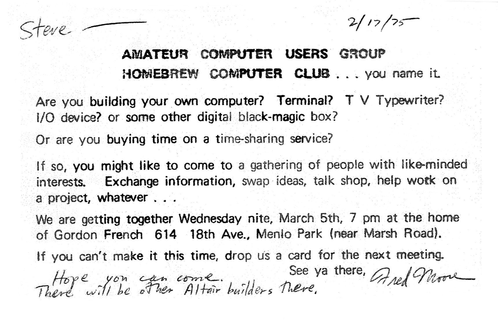
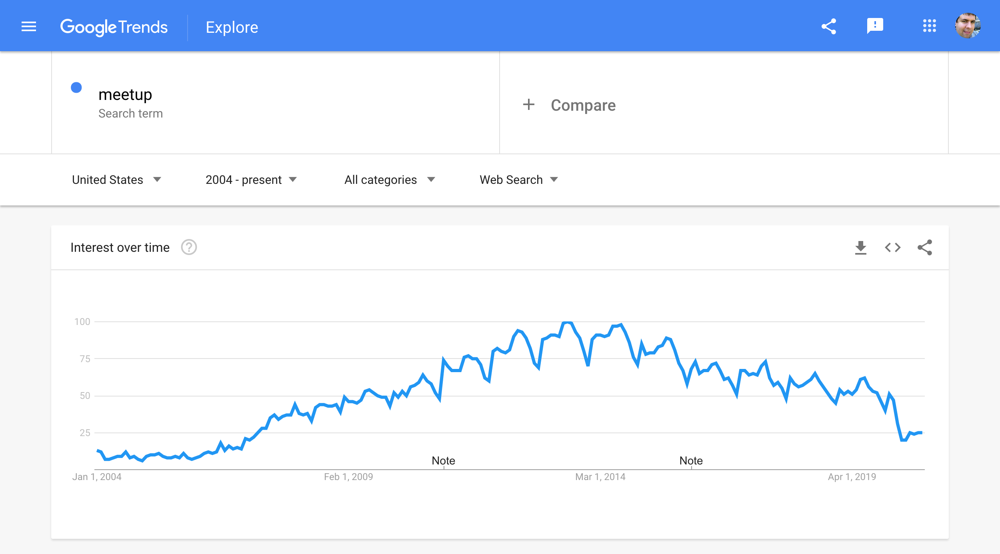

* Some Introductions: Hello world.
  * Why Are You Here?
    * Goal: Help clarify who this book is for and the structure of the book.
  * Who am I?
    * Goal: Be clear about my background and bias as the founder of Guildflow. Make it clear, this book is not about software, but people.
  * How best to read this book?

# NOTES

* I worry about this early chapter not being focused on the user's goals.
* At the moment if feels a little egotistical.

# Chapter 1

For as long as there have been computers there have been geeks meeting to discuss them. In modern times, these groups have formalized around the term meetup. This is a book dedicated to the power and positive impact of technical meetups.

If you are reading this book then you most likely are considering starting or otherwise putting energy into an existing technical meetup. First, thank you for efforts. These meetup groups can provide extremely positive cycles of volunteerism, education, work opportunities and friendships with a community. You are doing good works.

## People, not Software

While you will inevitably use many different tools and services to help you run your meetup group, I want to be clear up front: this is a book about people, not software.

Hello. 👋 

My name is Mike Zornek. I have been a participant and organizer of many technical meetups throughout my 20+ year career. Through these experiences I have come to many opinions about what makes for a successful meetup group. My opinions and dedication to meetup groups is so strong in fact, not only have they led me to write this book but I also build web applications to help people run meetup groups too.

The software platform is called Guildflow. It has been built specifically for technical meetups and while I am extremely proud of Guildflow and would love for you to check it out -- this book is about people, not software.

I just want to be transparent about my bias. When I knew I wanted to spend more time helping people in the meetup community, my first push was towards software. Now that the software is starting to mature I am putting energies into this book. There is overlap, and I'll be honest in that I'm marketing this book under the Guildflow name to help get some exposure but regardless if you choose to use Guildflow or something else, I have a ton of great things to share in this book that have nothing to do with software.

The truth is, most of running a meetup group is people problems: understanding what motivates people to attend events and volunteer; how to find a balance between productive engagement and spamming; and in general figuring out how to creating a space (physical and victual) where a community can thrive. 

## Knowing Your Past

Before we get into the what and how of running a meetup group I think it is important to reflect on how meetups have worked historically, how they have been trending, and how I suspect they will work in the years to come.

Like many things in the book, a lot of what I have to share is based on my personal history.

### Homebrew and the MUGs 

When I think of the origins of the modern technical meetup I think of the Homebrew Computer Club. [Via Wikipedia](https://en.wikipedia.org/wiki/Homebrew_Computer_Club):

> The Homebrew Computer Club was an informal group, which met from March 1975 to December 1986. It consisted of electronic enthusiasts and technically minded hobbyists who gathered to trade parts, circuits, and information pertaining to DIY construction of personal computing devices. It was started by Gordon French and Fred Moore who met at the Community Computer Center in Menlo Park. They both were interested in maintaining a regular, open forum for people to get together to work on making computers more accessible to everyone.

> Invitation to first Homebrew Computer Club meeting, sent by Fred Moore to Steve Dompier.

I am too young (and too based in Philly) to have participated in the Homebrew Computer Club but I was old enough to catch the tail end of the Macintosh User Groups era. These Macintosh User Groups, often called MUGs, were dedicated to helping people get the most ouf their Macs. [From Wikipedia](https://en.wikipedia.org/wiki/Macintosh_User_Group):

> MUGs exploded in size in the 1980s and were a primary method of distribution of freeware and shareware software. Many MUGs had a "Disk-of-the-Month" and large newsletters for members. Computer hardware and software companies found MUGs to be a valuable place to provide information about their products.

I recall attending many MUG meetings all over the greater Philadelphia area around 1997-2005.

There was a particularly active MUG in Delaware County that not only held general events, but also had a special interest group which focused on programming. I remember we met in the side room of a Mac repair shop and later a local diner on Saturday mornings once a month.

Another group met in center city Philadelphia and was dedicated to business issues. It was called MacBUS: the Macintosh Business Users Society. I don't recall when I started attending, but eventually around this time I started consulting so I suspect it was probably related to looking for clients.

A few years later a professor doing work in Objective-C and Cocoa started a group called Philadelphia Apple Developers, or PHAD. I think I discovered it through an active mailing list of the day called `cocoa-dev`. I recall being such an active member I practically became a co-host. It was a small and cozy group. It took no more than a pair of pizzas to keep us fed. We met and showed off our projects. I remember demoing my early Core Data experiments, wikis and Subversion.

All of this I consider to be pre-internet days. I mean yes, the internet was there but it was so young and immature it didn't really impact groups in a meaningful way.

## Philly Cocoa

, even borrowing my sister's car to drive there as I didn't even have a car of my own yet. 

There was group based in Deleware County which has main meetings and then special interest group meetings. I remember being a particularly active member of the Programming Special Interest Group as well as a sepeate user group dedicated toward business use of Macs called 

## Some Hard Realities

As I write this book it is September 2020. I live just outside of Philadelphia, PA and sadly the possibility of a physical meeting for my own groups is extremely unlikely for the rest of the year. COVID has hit meetups hard and for those of us who have been running groups for many years it has only accelerated a noticeable downward trend.

> Google Trends Chart showing the term "meetup" growing from 2004, peaking in 2014 and then declining since, with a sharp decline in 2020.

Even before COVID, meetups have been struggling. The TL;DR is simple: significant competition from the internet at large. 

No longer does one need to wait for the monthly meetup to hear about a new technical breakthroughs. No longer does one need to visit a centralized physical event to find other people who are interested in their preferred programming langrage or platform. 

Instead the people of your local tech community are:

* sharing code on GitHub
* chatting on Slack/Discord
* publishing tutorials on blogs
* sharing TIL (Today I Learned) tips on Twitter
* interviewing each other on podcasts 
* demoing on YouTube
* streaming on Twitch
* uploading slides on SpeakerDeck

It is an avalanche of technical info and with all do respect your little local meetup can not compete -- but that's ok.

## Successful Meetups are People, Not Presentations 

Personas who benifit most from meetup groups:

* Solo devs

Personas who are less likely to attend meetups:

* People who work in a team already doing Tech X

People connect on Slacks, 

While there are personal benefits to being a meetup organizer, on the whole it's 

 As someone who has attended and helped organize 

Like most books this collection

Throughout the rest of the book we'll review lots of 

## Hi, My Name is Mike

## How to Use This Book

